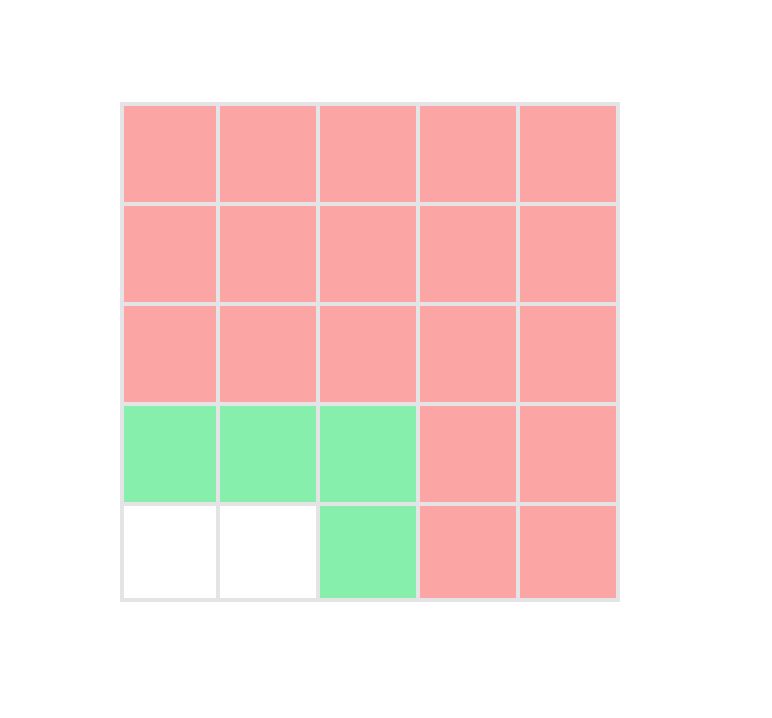

# Pandemic Simulator

|                                                                      |                    |
| -------------------------------------------------------------------- | ------------------ |
|  | Pandemic Simulator |

---


You can access the deployed version of Pandemic Simulator here:  
[Pandemic Simulator](http://ec2-3-19-242-208.us-east-2.compute.amazonaws.com/)

## Table of Contents

- [Description](#Description)
- [Flow](#Flow)
- [Installation](#Installation)
- [Deploying](#Deploying)
- [Usage](#Usage)
- [Contributing](#Contributing)
- [Tests](#Tests)
- [Questions](#Questions)
- [Authors](#Authors)

## Description

This is a Full-Stack (mainly Front-End) application that takes user input of dimensions (`height` and `width`) and renders a grid.

The user can then set `infection points` and `immune points` to outline the starting points of a pandemic.

With those points laid out on the grid, the user can press the `Simulate Pandemic` button to start a simulation of a pandemic.

The infection will be spreading to adjacent cells every second, infecting them and in turn causing them to start spreading the infection.

Immune points will remain untouched by the infection. They, however, will not spread.

| ->                                     | ->                                     | ->                                     |
| -------------------------------------- | -------------------------------------- | -------------------------------------- |
|  |  |  |

---

## Flow

It is a Vue.js (v2) application that utilizes Vuex store extensively.

`App.vue` is the first component to load, and it mainly takes care of the routes, as well as information that should be displayed on all the pages.

All the logic happens inside of the `Grid.vue` and `PandemicSimulator.vue` components. `PandemicSimulator` takes user input (dimensions of the grid), passes it to Vuex, and invokes the `Grid` component to render a grid.

The `Grid` component renders the grid and allows to interact with it by clicking on the cells directly.
The user can choose which points should be infected, and which points - immune.
When there's at least one infected cell, the user can click the `Simulate Pandemic` button to start infecting adjacent cells.

Every second of the infection spreading out equals to one day, and there's a date indicator to the right of the grid showing the exact day of the pandemic, starting from today.

The infection spreads as far as it can taking all the cells not protected by immune cells. When changes are no longer being made in the grid, the infection stops and shows the result - the full date when it reached maximum infection.

The user can then reset the grid to delete all immune and infected cells, or enter new values in the input fields to define new dimensions for the grid.

The main logic of the app is controller in the `Grid.vue` and `Vuex Store` files.

The main function that takes care of infecting cells is located in `/src/utils/infectCell.js`.
Its job is to confirm the possibility of infecting a cell in a specific direction passed in and infect or skip the infection if it is not possible.

## Installation

You need [Node.js](https://nodejs.org/en/) installed to run this app.

To install all the dependencies required to run this app, in the root folder run

```bash
npm install
```

In case of deploying on the server, additionally run

```bash
cd server && npm install
```

## Deploying

To deploy, assuming everything is installed, run the following commands on the server

```bash
cd server && node index.js
```

You can optionally pass in the `PORT` as an environment variable depending on the system.

The app is currently deployed to an EC2 AWS Instance with PM2 and Nginx serving as a reverse proxy, with both Nginx and PM2 being initialized on the startup to ensure consistent uptime.

## Usage

To open the development version of the app, run

```bash
npm run serve
```

Follow the instructions from the **About** page on how to proceed.

## Contributing

Pull requests for new features or bug fixes and issues related to those are very welcome!

## Tests

This application has very extensive Front-End tests.

To test the app, run

```bash
npm run test:unit
```

This will run the test suite and test the flow of all major components and functions.

When contributing, please make sure to add tests for new code.

## Questions

Reach out to me with any questions via email:  
sd32@pm.me

## Contributors

Maksim Verkhoturov
